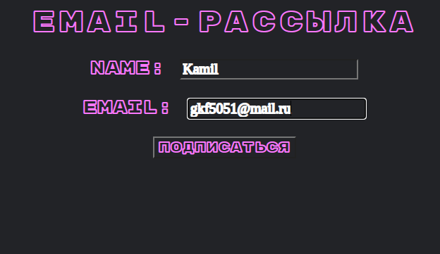
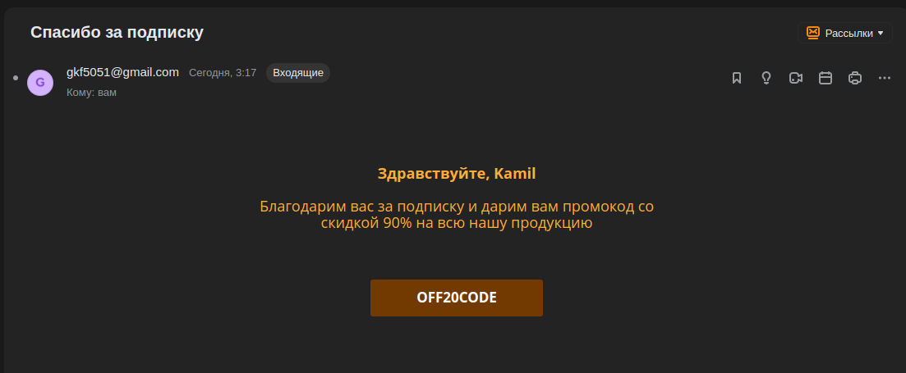
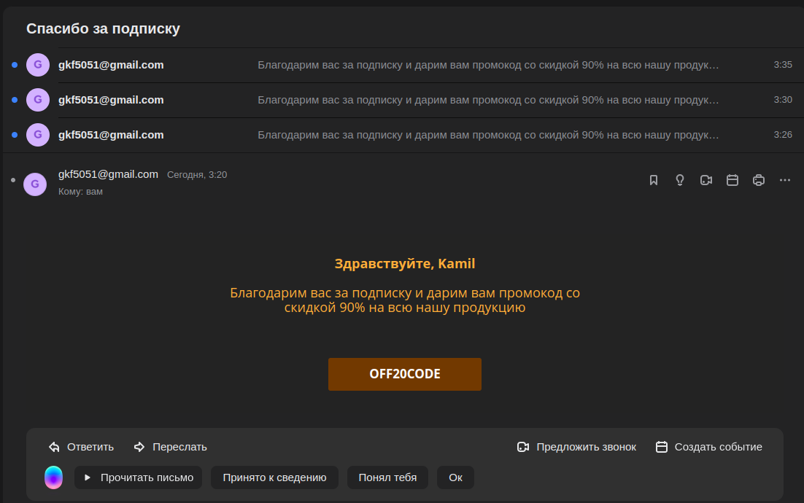

# Тестовое задание. Сервис email-рассылок
<h3>Возможности:</h3> 

— подписка на рассылку после ввода имени и почты

— рассылка с использованием html-шаблона и переменными (имя подписчика)

— отложенная рассылка, реализованная с помощью celery

<h2>Подписка на рассылку после ввода имени и почты</h2>

<h2>Рассылка с использованием html-шаблона и переменными (имя подписчика)</h2>

<h2>Отложенная рассылка, реализованная с помощью celery и redis(5 минут)</h2>

Для старта отложенной рассылки необходимо применить команды:

python manage.py runserver  

celery -A send_email beat -l info

celery -A send_email worker -l info

